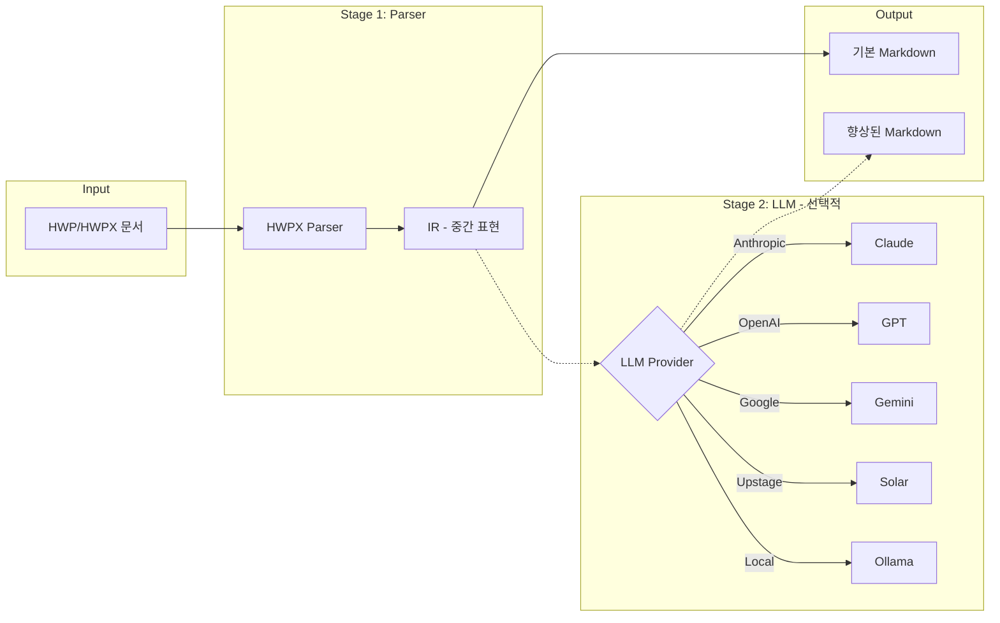

# hwp2markdown

[](https://go.dev/)
[](LICENSE)
[](https://github.com/roboco-io/hwp2markdown/actions/workflows/test.yml)
[](https://goreportcard.com/report/github.com/roboco-io/hwp2markdown)

HWP(한글 워드프로세서) 문서를 Markdown으로 변환하는 CLI 도구

## 개요

이 프로젝트는 HWP/HWPX 문서를 Markdown으로 변환합니다. HWP는 복잡한 테이블 레이아웃, 중첩 표, 다단 구성 등 Markdown에서 직접 표현하기 어려운 구조를 포함할 수 있습니다. 이러한 구조적 차이를 극복하기 위해 2단계 파이프라인 아키텍처를 사용하며, 필요시 LLM을 활용하여 더 읽기 쉬운 Markdown을 생성합니다.

### 아키텍처



| Stage | 설명 | 출력 |
|-------|------|------|
| **Stage 1 (Parser)** | 문서를 파싱하여 중간 표현(IR)으로 변환 | 구조화된 기본 Markdown |
| **Stage 2 (LLM)** | LLM을 사용하여 IR을 깔끔한 Markdown으로 포맷팅 | 가독성이 향상된 Markdown |

Stage 1만으로도 기본적인 변환이 가능하지만, 복잡한 레이아웃의 문서는 Stage 2(LLM)를 통해 가독성을 크게 향상시킬 수 있습니다.

## 설치

### Go 설치 (권장)

```bash
go install github.com/roboco-io/hwp2markdown/cmd/hwp2markdown@latest
```

### 바이너리 다운로드

[GitHub Releases](https://github.com/roboco-io/hwp2markdown/releases)에서 플랫폼별 바이너리를 다운로드할 수 있습니다.

| 플랫폼 | 아키텍처 | 파일 |
|--------|----------|------|
| Windows | x64 | `hwp2markdown_*_windows_amd64.zip` |
| macOS | Intel | `hwp2markdown_*_darwin_amd64.tar.gz` |
| macOS | Apple Silicon | `hwp2markdown_*_darwin_arm64.tar.gz` |
| Linux | x64 | `hwp2markdown_*_linux_amd64.tar.gz` |

## 사용법

### 기본 변환 (Stage 1만)

```bash
# HWPX 파일을 Markdown으로 변환
hwp2markdown document.hwpx -o output.md

# 표준 출력으로 변환
hwp2markdown document.hwpx
```

> **Note**: `convert` 명령어는 기본 명령이므로 생략할 수 있습니다.
> `hwp2markdown document.hwpx`와 `hwp2markdown convert document.hwpx`는 동일합니다.

### LLM 포맷팅 (Stage 2)

LLM을 사용하면 더 자연스럽고 읽기 쉬운 Markdown을 생성할 수 있습니다.

```bash
# Anthropic Claude 사용 (기본)
export ANTHROPIC_API_KEY="your-api-key"
hwp2markdown convert document.hwpx --llm

# OpenAI GPT 사용
export OPENAI_API_KEY="your-api-key"
hwp2markdown convert document.hwpx --llm --provider openai

# Google Gemini 사용
export GOOGLE_API_KEY="your-api-key"
hwp2markdown convert document.hwpx --llm --provider gemini

# Upstage Solar 사용
export UPSTAGE_API_KEY="your-api-key"
hwp2markdown convert document.hwpx --llm --provider upstage

# Ollama 사용 (로컬)
hwp2markdown convert document.hwpx --llm --provider ollama --model llama3.2
```

### IR 추출

```bash
# JSON 형식으로 IR 추출
hwp2markdown extract document.hwpx -o output.json

# 텍스트 형식으로 추출
hwp2markdown extract document.hwpx --format text
```

### 환경 변수

| 변수 | 설명 |
|------|------|
| `HWP2MD_LLM` | `true`로 설정하면 LLM 포맷팅 활성화 |
| `HWP2MD_MODEL` | 사용할 모델 이름 (프로바이더 자동 감지) |
| `HWP2MD_BASE_URL` | 프라이빗 API 엔드포인트 (Bedrock, Azure, 로컬 서버) |
| `ANTHROPIC_API_KEY` | Anthropic API 키 |
| `OPENAI_API_KEY` | OpenAI API 키 |
| `GOOGLE_API_KEY` | Google Gemini API 키 |
| `UPSTAGE_API_KEY` | Upstage API 키 |
| `OLLAMA_HOST` | Ollama 서버 주소 (기본: http://localhost:11434) |

모델 이름으로 프로바이더가 자동 감지됩니다:
- `claude-*` → Anthropic
- `gpt-*`, `o1-*`, `o3-*` → OpenAI
- `gemini-*` → Google Gemini
- `solar-*` → Upstage
- 그 외 → Ollama (로컬)

### 프라이빗 테넌시

AWS Bedrock, Azure OpenAI, 로컬 서버 등 프라이빗 엔드포인트를 사용할 수 있습니다:

```bash
# AWS Bedrock
hwp2markdown convert document.hwpx --llm --model claude-3-sonnet --base-url https://bedrock-runtime.us-east-1.amazonaws.com

# Azure OpenAI
hwp2markdown convert document.hwpx --llm --model gpt-4 --base-url https://your-resource.openai.azure.com

# 로컬 서버
hwp2markdown convert document.hwpx --llm --model llama3.2 --base-url http://localhost:8080
```

## 지원 포맷

| 포맷 | 상태 | 설명 |
|------|------|------|
| HWPX | ✅ 지원 | XML 기반 개방형 포맷 (한컴오피스 2014+) |
| HWP 5.x | 🚧 계획 | OLE/CFBF 바이너리 포맷 |
| HWP 3.x | 미정 | 레거시 바이너리 포맷 |

## LLM 프로바이더

| 프로바이더 | 기본 모델 | 설명 |
|------------|-----------|------|
| `anthropic` | claude-sonnet-4-20250514 | Anthropic Claude |
| `openai` | gpt-4o-mini | OpenAI GPT (Azure, Bedrock 호환) |
| `gemini` | gemini-1.5-flash | Google Gemini |
| `upstage` | solar-pro | Upstage Solar |
| `ollama` | llama3.2 | 로컬 Ollama 서버 |

## 개발

### 요구사항

- Go 1.24 이상

### 빌드

```bash
# 저장소 클론
git clone https://github.com/roboco-io/hwp2markdown.git
cd hwp2markdown

# 의존성 다운로드
go mod download

# 빌드
make build

# 테스트
make test

# 린트 (golangci-lint 필요)
make lint
```

### 프로젝트 구조

```
hwp2markdown/
├── cmd/hwp2markdown/      # CLI 엔트리포인트
├── internal/
│   ├── cli/               # CLI 명령 구현
│   ├── config/            # 설정 관리
│   ├── ir/                # 중간 표현 (Intermediate Representation)
│   ├── llm/               # LLM 프로바이더
│   │   ├── anthropic/     # Anthropic Claude
│   │   ├── openai/        # OpenAI GPT
│   │   ├── gemini/        # Google Gemini
│   │   ├── upstage/       # Upstage Solar
│   │   └── ollama/        # Local Ollama
│   └── parser/            # 문서 파서
│       └── hwpx/          # HWPX 파서
├── docs/                  # 문서
└── tests/                 # 테스트 데이터
```

## 변환 품질 예시

실제 변환 결과를 확인하여 품질을 평가할 수 있습니다.

### Stage 1 (Parser)

| 파일 | 설명 |
|------|------|
| [원본 HWPX](testdata/한글%20테스트.hwpx) | 테스트용 한글 문서 (공무원 채용 공고) |
| [Stage 1 결과](testdata/한글%20테스트_stage1.md) | 파서만 사용한 기본 Markdown 변환 |

### Stage 2 (LLM 비교)

동일한 문서를 여러 LLM으로 변환한 결과를 비교할 수 있습니다.

| LLM | 결과 | 모델 |
|-----|------|------|
| Claude | [결과 보기](testdata/한글%20테스트_stage2_claude.md) | claude-sonnet-4-20250514 |
| Gemini | [결과 보기](testdata/한글%20테스트_stage2_gemini.md) | gemini-2.0-flash |
| Solar | [결과 보기](testdata/한글%20테스트_stage2_solar.md) | solar-pro |

Stage 1은 문서 구조를 그대로 추출하며, Stage 2는 LLM을 통해 더 읽기 쉬운 형태로 정리합니다.

> 테스트 파일 출처: [한국문화원 문서 뷰어 테스트 예시](https://www.korean-culture.org/operT2st/view.do?seq=1047514)

## 문서

- [PRD](docs/PRD.md) - 제품 요구사항
- [기술 스택](docs/tech-stack.md) - 기술 스택 결정
- [HWPX 스키마](docs/hwpx-schema.md) - HWPX 파일 포맷 문서
- [HWPX-Markdown 차이점](docs/hwpx-markdown-differences.md) - 포맷 간 차이점 및 변환 방식

## 라이센스

MIT License - 자세한 내용은 [LICENSE](LICENSE) 파일을 참조하세요.
